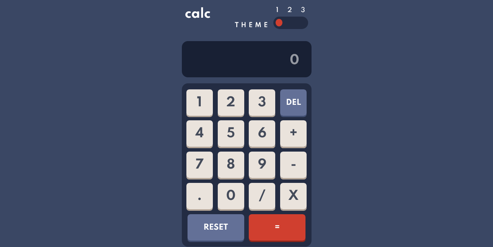

# Frontend Mentor - Calculator app solution

This is a solution to the [Calculator app challenge on Frontend Mentor](https://www.frontendmentor.io/challenges/calculator-app-9lteq5N29). Frontend Mentor challenges help you improve your coding skills by building realistic projects. 

## Table of contents

- [Overview](#overview)
  - [The challenge](#the-challenge)
  - [Screenshot](#screenshot)
  - [Links](#links)
- [My process](#my-process)
  - [Built with](#built-with)
  - [What I learned](#what-i-learned)
  - [Continued development](#continued-development)
  - [Useful resources](#useful-resources)
- [Author](#author)
- [Acknowledgments](#acknowledgments)

**Note: Delete this note and update the table of contents based on what sections you keep.**

## Overview

### The challenge

Users should be able to:

- See the size of the elements adjust based on their device's screen size
- Perform mathmatical operations like addition, subtraction, multiplication, and division
- Adjust the color theme based on their preference
- **Bonus**: Have their initial theme preference checked using `prefers-color-scheme` and have any additional changes saved in the browser

### Screenshot

screenshot included

### Links

- Solution URL: [Add solution URL here](https://your-solution-url.com)
- Live Site URL: [Add live site URL here](https://your-live-site-url.com)

## My process

I built this project almost completely with just functions and then I saw a video by Dcode on youtube that made a keyboard as a javascript object. I thought that it was the cleaner way to make this project.  However I was confused about the EventHandler part of the object so I think there is something I need to learn.  I did not play with the desktop design themes so much because I already spent too much time on this project remaking it.  I did manage to get the toggle and all 3 themes working. And I made it somewhat responsive.

here's the link to the video:
https://www.youtube.com/watch?v=N3cq0BHDMOY&t=2376s  

### Built with

vanilla Javascript, HTML and CSS

**Note: These are just examples. Delete this note and replace the list above with your own choices**

### What I learned

working with an object to create this project rather than just functions.

### Continued development

I used minimal HTML in the index.html file becuase I constructed the calculator with javascript in 
_init() function of the object
### Useful resources

watched a dcode youtube video to help me make this project.  video link is up above

## Author

- Website - [Jim Snelgrove](https://www.your-site.com)
- Frontend Mentor - [@slevkalev](https://www.frontendmentor.io/profile/yourusername)
- Twitter - [@SnelgroveJim](https://www.twitter.com/yourusername)

**Note: Delete this note and add/remove/edit lines above based on what links you'd like to share.**

## Acknowledgments

This is where you can give a hat tip to anyone who helped you out on this project. Perhaps you worked in a team or got some inspiration from someone else's solution. This is the perfect place to give them some credit.

**Note: Delete this note and edit this section's content as necessary. If you completed this challenge by yourself, feel free to delete this section entirely.**
